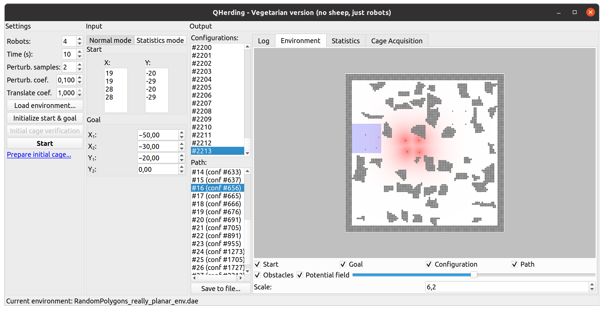
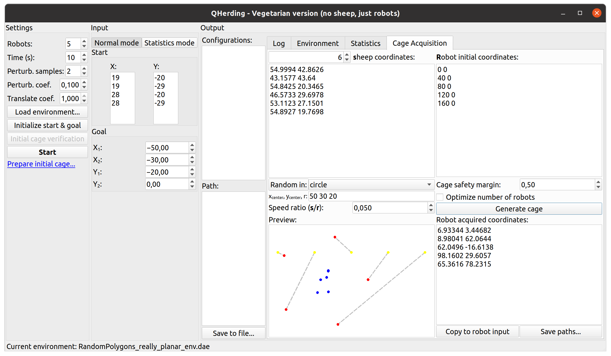
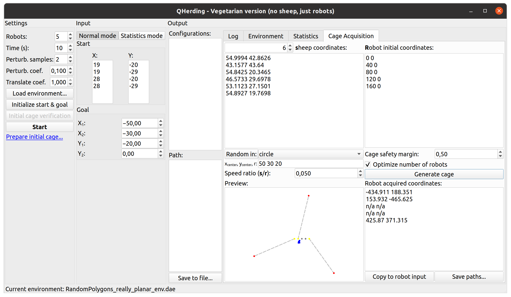

## Herding by caging: a formation-based motion planning framework for guiding mobile agents

Official implementation of the herding-by-caging algorithm ([Herding by caging: a formation-based motion planning framework for guiding mobile agents](https://link.springer.com/article/10.1007/s10514-021-09975-8))

**TL;DR** The software implements a [herding-by-caging algorithm]([https://journals.sagepub.com/doi/full/10.1177/0278364920932996](https://doi.org/10.15607/rss.2017.xiii.074)) for steering mobile agents (referred to in the code as _sheep_) by a set of robotic herders (referred to in the code as _robots_) forming a high-potential cage around them. Apart from modifying a classic RRT algorithm to the configuration space of cages, the software implements the cage acquisition algorithm (forming a cage given the starting positions of robots and sheep) and provides a UI for running the experiments.

_Please note! This code was only written to perform experiments for the aforementioned papers and streamline our development of the algorithms. It is therefore not kept up to the production code standards and was neither optimized nor thoroughly tested._

#### Dependencies

The backend of the software uses OMPL as it provides convenient tools to perform path planning. The computational geometry implementation uses CGAL for building alpha shapes. The use of CGAL in this case is justified by the convenience, and such dependency can be easily mitigated by using a direct implementation of an alpha shape algorithm. The UI side of the software is based on Qt.

### Installation instructions

1. [Install CGAL](https://www.cgal.org/download/linux.html)
2. [Install OMPL](http://ompl.kavrakilab.org/installation.html)
3. [Install Qt development tools](https://wiki.qt.io/Install_Qt_5_on_Ubuntu)
4. Open `QtHerding.pro` in Qt Creator, build and run the project.

The code was tested with CGAL 4.7, OMPL 1.5, and Qt 5.15.2 on Ubuntu 20.04.4 LTS.

### Functionality overview

#### Running and visualizing RRT search

#### Cage acquisition

#### Cage acquisition, minimizing the number of engaged robots

